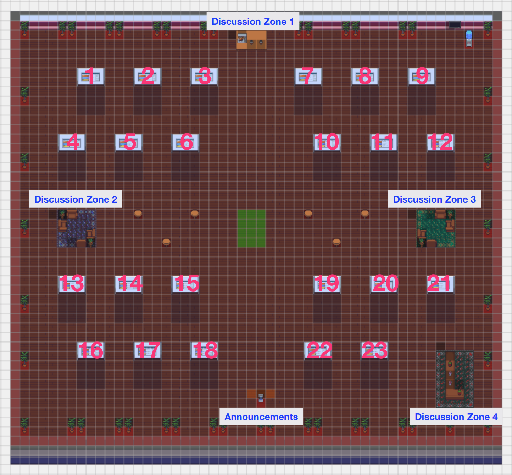

## How Can Findings About The Brain Improve AI Systems?
[ICLR 2021](https://iclr.cc/Conferences/2021/) Workshop, Taking place virtually
##### May 7, 2021 ~~May 8, 2021~~ 

## [View the workshop](https://iclr.cc/virtual/2021/workshop/2135)

 
## Google Group
[https://groups.google.com/d/forum/context-comp](https://groups.google.com/d/forum/context-comp)
 

## About
The brain comprises billions of neurons organized into an intricate network of highly specialized functional areas. This biological cognitive system can efficiently process vast amounts of multi-modal data to perceive and react to its ever-changing environment. Unlike current AI systems, it does not struggle with domain adaptation, few-shot learning, or common-sense reasoning. However, it also differs from artificial neural networks in many ways. For instance, there is evidence that the brain sparsely encodes information (e.g. the famous `Jennifer Aniston' neuron [1]). Deep neural networks, on the other hand, are dense and redundant. While learning is reward- and feedback-based in both biological and artificial networks, it is not clear that the brain is implementing anything analogous to backpropagation. Further, evidence suggests that biological neurons can replicate recurrence [2] but their ability to do convolution or operations similar to dot-product attention is unclear. 
However, inspiration from neuroscience has benefited AI in the past: modern convolutional networks mimic the deep, nested information flow in visual cortex [3], and hippocampal replay of previous experiences has brought about experience replay in reinforcement learning [4]. Recent work at the intersection of neuroscience and AI has made progress in directly integrating neuroscientific data with AI systems and has led to learned representations that are more robust to label corruptions [5,6], allow for better generalization in some language tasks [7,8], and provide new ways to interpret [7,9,10,11,12,13] and evaluate [14,15,16,17,18,19,20,21] what domain-relevant information is learned by deep neural networks. In this workshop, we aim to examine the extent to which insights about the brain can lead to better AI. 

Specifically, this workshop aims to address some of the following fundamental questions:
- What areas of AI can most benefit from neuroscientific insight (e.g. commonsense reasoning, symbol grounding, architecture search and learning rules, continual learning, interpretability, few-shot learning)?
- What are the current bottlenecks in integrating neuroscientific data with AI systems (e.g. limited amount of data, amount of noise, mismatch in experimental tasks)?
- Which granularities of neuroscientific data are best suited to integrate with AI systems (e.g. recordings from cells of non-human species, multi-unit recordings from local neuron populations, neuroimaging recordings)?
- What are the benefits and limits of data-driven approaches that integrate neuroscientific data into the training process of AI systems?
- How can neuroscientific data benefit AI systems that perform tasks at which humans excel (e.g. natural language processing, vision)?

## Important Dates

|---
| Name | Date
|:------ |:------
| Paper Submission Deadline | March 9th, 2021 (3pm EST) 
| Final Decisions | March 26, 2021 (11:59pm EST)
| Camera Ready Deadline | April 15, 2021 (11:59pm EST)
| Workshop Date | ~~May 8, 2021~~ May 7, 2021

## Schedule

Date: ~~Saturday May 8, 2021~~ Friday May 7, 2021

Taking place virtually, Times given are Eastern Standard Time

|---
| Time (EST) | Event
|:------ |:------
|09:30 AM | Opening Remarks 
|10:00 AM | Invited Speaker Talk - Mike Davies 
|11:00 AM | Panel Discussion 
|12:30 AM | Coffee/Lunch Break 
|01:00 PM | Spotlights/Contributed Talks 1 
|02:00 PM | Invited Speaker Talk - Jack Gallant 
|03:00 PM | Coffee/Lunch Break
|04:00 PM | Invited Speaker Talk - Anima Anandkumar
|05:00 PM | Invited Speaker Talk - Alona Fyshe
|06:00 PM | Spotlights/Contributed Talks 1
|07:00 PM | Invited Speaker Talk - Kenji Doya
|08:15 PM | Closing Remarks
|---





## Call for Papers

Submit at: [https://cmt3.research.microsoft.com/BRAIN2AI2021/Submission/Index](https://cmt3.research.microsoft.com/BRAIN2AI2021/Submission/Index)

We will consider the following (non-exhaustive) list of topics for contribution:
- Data-driven integration of neuroscientific data into the training of AI systems
- Brain-inspired inductive biases for AI systems
- Neuroscientific data as an evaluation metric for AI systems
- Mechanistic insight into cognitive functions (vision, language, decision making, attention, etc.)
- Limitations of current AI systems in tasks at which humans excel (compositionality, commonsense reasoning, continual learning, few-shot learning, causality, etc.)
- Cross-modality and cross-species comparisons of neuroscientific data with respect to benefits to AI
- Datasets that can facilitate the transfer of neuroscientific insight to AI

**Formatting Instructions:**  All submissions must be in PDF format. Submissions are limited to four content pages, including all figures and tables; additional pages containing only references are allowed. You must format your submission using the [ICLR 2021 LaTeX style files](https://github.com/ICLR/Master-Template/raw/master/archive/iclr2021.zip). Submissions that meaningfully violate the ICLR style (e.g., by decreasing margins or font sizes) or page limits may be rejected without further review. All submissions should be anonymous.

The accepted papers will be made publicly available as non-archival reports, allowing future submissions to archival conferences or journals.

The review process is double-blind. We also welcome published papers that are within the scope of the workshop (without re-formatting). Already-published papers do not have to be anonymous. They are eligible for the spotlight sessions and will only have a very light review process. Note that preprints that have not yet been accepted for publication at a peer-reviewed venue are not considered as published work and need to be reformatted according to our instructions. 

**Virtual Format:** The workshop itself will be geared towards more dynamic and interactive discussion focused on Q&A sessions, with less time devoted to speakers giving one-sided talks to attendees. Invited speakers will give live talks but will be asked to devote as much time to audience questions as to the presentation. Accepted abstracts and papers will result in, at minimum, a spotlight talk. Contributed spotlight talks will be pre-recorded to ensure that time traditionally allotted to posters will be used to foster discussion and participant questions from the contributed talks. 

All presenters, whether invited or contributed, will be given live virtual "coffee break" rooms during all breaks in the conference schedule to engage in small group discussions with participants. Discussions around talks will be organized in live virtual "breakout" rooms with similar topic and themes so that workshop attendees and presenters can get the chance to interact with each other in a less formal, discussion-centric setting. We intend to encourage spotlight talk applicants to fully leverage the didactic benefits of the digital medium by including elements of animation or interactivity into their presentations. The themes for the breakout rooms will be changed for each break to give speakers, panelists and participants a chance to focus on different aspects of their work and to interact with different groups.

Please redirect questions and all future correspondence to [brain2ai.2021@gmail.com](mailto:brain2ai.2021@gmail.com).

## Accepted Papers
The following papers were accepted to the workshop. Full papers will be released during the workshop and one month later to nonregistered parties. 

|---
| Poster # | GatherTown Time Slot (EST) | Title
|:----- |:--------- |:------
| 1 | 1PM - 2PM | Brain-inspired Weighted Normalization for CNN Image Classification
| 2 | 1PM - 2PM | Neuroscience-inspired perception-action in robotics: applying active inference for state estimation, control and self-perception
| 3 | 1PM - 2PM | A learning gap between neuroscience and reinforcement learning
| 5 | 1PM - 2PM | Improved object recognition using neural networks trained to mimic the brain’s statistical properties
| 6 | 1PM - 2PM | Learning-dependent enhancement of persistent activity in neocortex
| 7 | 1PM - 2PM | The neuroscience of spatial navigation and the relationship to artificial intelligence
| 8 | 1PM - 2PM | Towards robust vision by multi-task learning on monkey visual cortex
| 9 | 1PM - 2PM | Cortical network responses map onto data‑driven features that capture visual semantics of movie fragments
| 10 | 1PM - 2PM | Towards naturalistic speech decoding from brain data
| 11 | 1PM - 2PM | Contextual integration in cortical and convolutional neural networks
| 12 | 1PM - 2PM | Joint interpretation of representations in neural networks and the brain
| 13 | 6PM - 7PM | Training cascaded networks for speeded decisions using a temporal-difference loss
| 14 | 6PM - 7PM | Probing artificial neural networks: Insights from neuroscience
| 15 | 6PM - 7PM | Information theoretic characterization of uncertainty distinguishes surprise from accuracy signals in the brain
| 16 | 6PM - 7PM | Gaze Perception in Humans and CNN-based Model
| 17 | 6PM - 7PM | Comparing visual reasoning in humans and AI
| 18 | 6PM - 7PM | Cross-modal emotion recognition: How similar are patterns between DNNs and human fMRI data?
| 19 | 6PM - 7PM | Learning to Predict in Networks with Heterogeneous and Dynamic Synapses
| 20 | 6PM - 7PM | Simulating a Primary Visual Cortex at the Front of CNNs Improves Robustness to Image Perturbations 
| 21 | 6PM - 7PM | Cloze Distillation: Improving Neural Language Models with Human Next-Word Predictions
| 22 | 6PM - 7PM | Learning without gradient decent encoded by the dynamics of a neurobiological model
| 23 | 6PM - 7PM | Comparing Neural Mechanisms for Shifting Attention in Space and Social Knowledge
|---

## Workshop Poster Session GatherTown Layout

Accepted papers will be presented in a virtual poster session at our workshop's GatherTown, which will be accesible from the workshop's page on the ICLR website on the day of the workshop. An annotated image specifying the layout of the GatherTown is shown below:

## Program Committee

* Janice Chen
* James DiCarlo
* Kenji Doya
* Stefan L Frank
* Alona Fyshe
* Tim Kietzmann
* Jean-Rémi King
* Liberty Hamilton
* Chris Honey
* Anna Ivanova
* Sharmishta Jat
* Niru Maheswaranthan
* David Gonzalez-Aguirre
* Javier Felip-Leon
* Daniel Ben-Dayan Rubin
* Paxon Frady
* Andreas Wild
* and all Organizing Committee Members

## References

1. Quiroga, R. Quian, et al. "Invariant visual representation by single neurons in the human brain." Nature 435.7045 (2005): 1102-1107.
2. Kietzmann, Tim C., et al. "Recurrence is required to capture the representational dynamics of the human visual system." Proceedings of the National Academy of Sciences 116.43 (2019): 21854-21863.
3. Hassabis, Demis, et al. "Neuroscience-inspired artificial intelligence." Neuron 95.2 (2017): 245-258.
4. Davidson, Thomas J., Fabian Kloosterman, and Matthew A. Wilson. "Hippocampal replay of extended experience." Neuron 63.4 (2009): 497-507.
5. Li, Zhe, et al. "Learning from brains how to regularize machines." Advances in Neural Information Processing Systems. 2019. Vishwanathan, and R. Garnett, editors,Advances in Neural Information ProcessingSystems 30, pages 5998–6008. Curran Associates, Inc., 2017.
6. Federer, Callie, et al. "Improved object recognition using neural networks trained to mimic the brain’s statistical properties." Neural Networks 131 (2020): 103-114.
7. Toneva, Mariya, and Leila Wehbe. "Interpreting and improving natural-language processing (in machines) with natural language-processing (in the brain)." Advances in Neural Information Processing Systems. 2019.
8. Schwartz, Dan, Mariya Toneva, and Leila Wehbe. "Inducing brain-relevant bias in natural language processing models." Advances in Neural Information Processing Systems. 2019.
9. Fyshe, Alona, et al. "Interpretable semantic vectors from a joint model of brain-and text-based meaning." Proceedings of the conference. Association for Computational Linguistics. Meeting. Vol. 2014. NIH Public Access, 2014.
10. Søgaard, Anders. "Evaluating word embeddings with fMRI and eye-tracking." Proceedings of the 1st Workshop on Evaluating Vector-Space Representations for NLP. 2016.
11. Eickenberg, Michael, et al. "Seeing it all: Convolutional network layers map the function of the human visual system." NeuroImage 152 (2017): 184-194.
12. Kell, Alexander JE, et al. "A task-optimized neural network replicates human auditory behavior, predicts brain responses, and reveals a cortical processing hierarchy." Neuron 98.3 (2018): 630-644.
13. Jain, Shailee, and Alexander Huth. "Incorporating context into language encoding models for fmri." Advances in neural information processing systems. 2018.
14. Xu, Haoyan, Brian Murphy, and Alona Fyshe. "Brainbench: A brain-image test suite for distributional semantic models." Proceedings of the 2016 Conference on Empirical Methods in Natural Language Processing. 2016.
15. Feather, Jenelle, et al. "Metamers of neural networks reveal divergence from human perceptual systems." Advances in Neural Information Processing Systems. 2019.
16. Schrimpf, Martin, et al. "Integrative benchmarking to advance neurally mechanistic models of human intelligence." Neuron (2020).
17. Schrimpf, Martin, et al. "Artificial Neural Networks Accurately Predict Language Processing in the Brain." BioRxiv (2020).
18. Hashemzadeh, Maryam, et al. "From Language to Language-ish: How Brain-Like is an LSTM's Representation of Nonsensical Language Stimuli?." arXiv preprint arXiv:2010.07435 (2020).
19. Bender, Emily M., and Alexander Koller. "Climbing towards NLU: On meaning, form, and understanding in the age of data." Proc. of ACL. 2020.
20. Martin, Andrea E., and Leonidas AA Doumas. "Tensors and compositionality in neural systems." Philosophical Transactions of the Royal Society B 375.1791 (2020): 20190306.
21. Fyshe, Alona, et al. "A compositional and interpretable semantic space." Proceedings of the 2015 conference of the north american chapter of the association for computational linguistics: Human language technologies. 2015.
